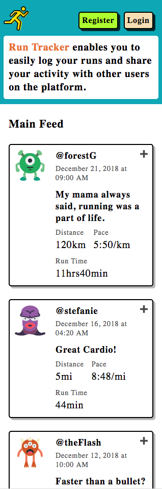
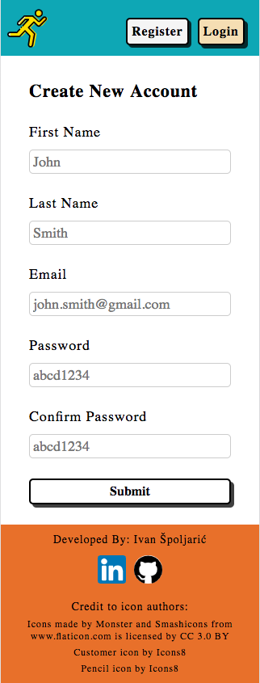
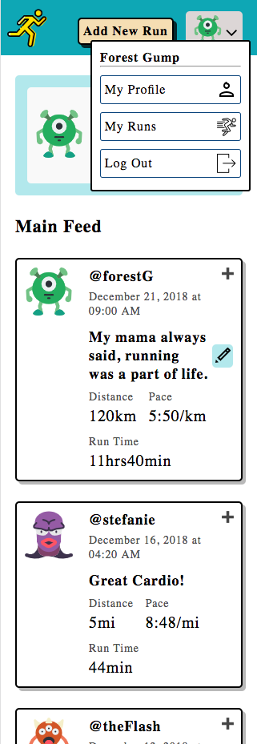
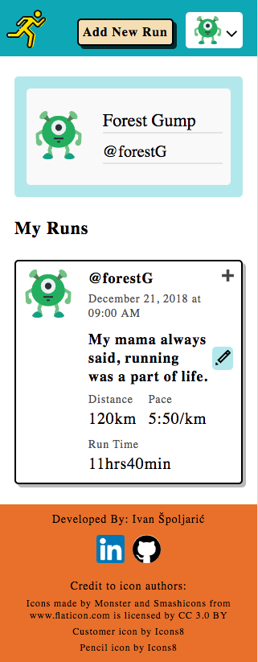
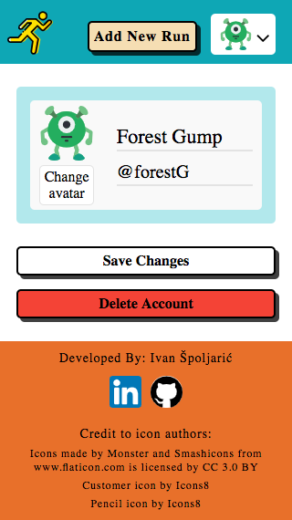
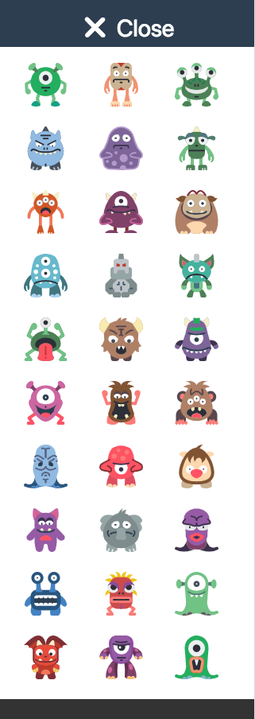
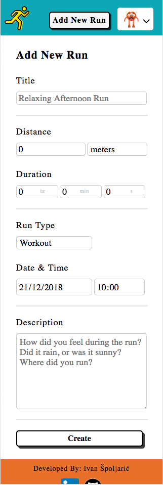
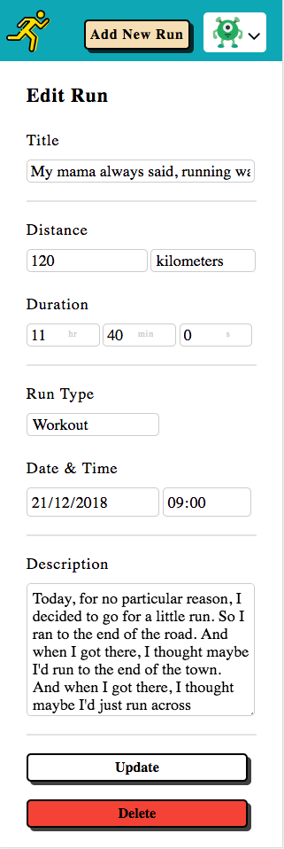

# Run Tracker App

## LINK TO THE APP:
[https://pure-peak-20096.herokuapp.com/](https://pure-peak-20096.herokuapp.com/)

## SUMMARY
This app is intended for athletes that whish to log their running activities and share them with other users on the platform.

## WHAT THE USER CAN DO:

* register
* login (credentials: email, password)
* see his previous posts (my runs page)
* see all posts from other users on the     platform (home page)
* see posts only from a specific user
* create a new post (run)
* update an existing post
* delete a post
* change his avatar
* change his full name
* change his display name
* delete his account

## BUILT WITH:

**SERVER**: NODE.JS (RESTful API on EXPRESS.JS)

**DATABASE**: MONGODB

**ORM LAYER**: MONGOOSE

**TESTING**: MOCHA, CHAI

**CONTINUOS INTEGRATION**: TRAVISCI

**CLIENT SIDE**: HTML5, CSS3, ES6 JAVASCRIPT (MVC architecure)

**AUTOMATION**: WEBPACK

## DESIGN PARADIGMS

* mobile-first
* RWD
* a11y
* SEO
* cross-browser compatibility

## SCREENSHOTS (DESKTOP)

Home feed (logged out):

Registration form:

Home Feed (logged in):

My Runs Page:

My Profile Page:

Choose Avatar Menu:

Add New Run form:

Edit Run form:

## WHAT IS PLANNED FOR FUTURE DEVELOPMENT:
* login with google or facebook using the OAUTH protocol
* enable userst to upvote/downvote posts
* enale users to analyze their running progress on a weekly/monthly basis (implement graphs with D3.js library)
* enable sharing posts to other social networks
* enable importing/exporting running activity from/to third-party apps (like Strava)
* implement cookie-based (session) authorization
* create a real-time app using the WebSocket protocol (a persistent, low latency connection with the server is more appropriate for this app, instead of traditional HTTP requests)

## TECHNICAL DESCRIPTION
The backend is running on a NodeJS server. 

It is hosted on Heroku, and using a single (free-tier) dyno. For that reason, it doesn't support a high number of concurent users. Also, if inactive for some time, heroku will suspend the dyno, and the first user that tries to access the app after that, will experience a slower load time. 

The MongoDB database is hosted on mLab (also free-tier). 

The RESTful API is implemented using ExpressJS. It supports CRUD operations which are implemented by sending HTTP requests (GET, POST, PUT, DELETE) to 2 different endpoints; /api/users/ and /api/posts/. 

Authorization is implemented using JWT tokens. It is accessible through the API on the /api/auth/ endpoint. A valid JWT token is sent every time a user logs in.

Data is modeled with Mongoose which serves as an ORM  layer between Node and MongoDB. There are two types of data models in this app; user and post.

Data validation is implemented mostly on the server side using the Joi library. There is some HTML and JS validation on the frontend side as well.

This app was developed using the TDD paradigm. Unit and integration tests were written for each endpoint, with normal and fail cases. Continuous integration is implemented using TravisCI on every pull request or merge to master. 

The frontend static files are served from the server's /public folder.

The frontend communicates with the backend by sending HTTP AJAX requests to the API. A simple, but effective JS library called Axios is used.

The code is (mostly) pure javscript. It is modularized according to the MVC paradigm. 
